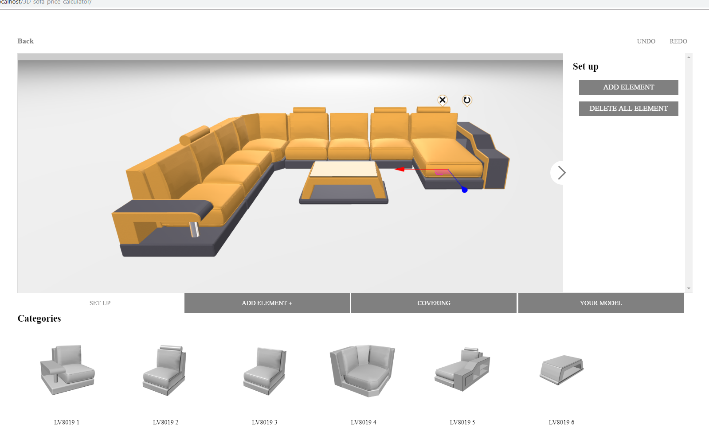
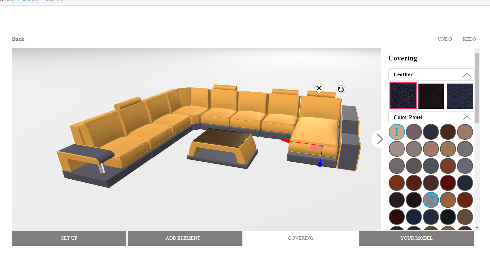
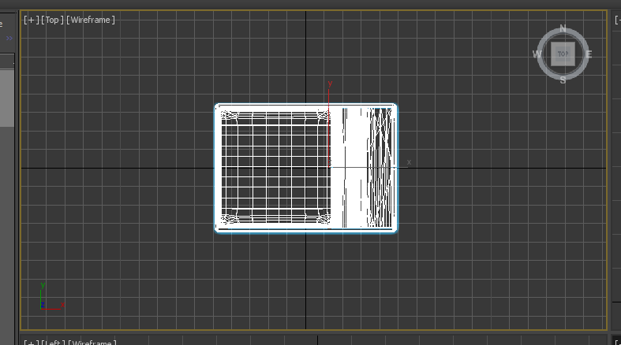
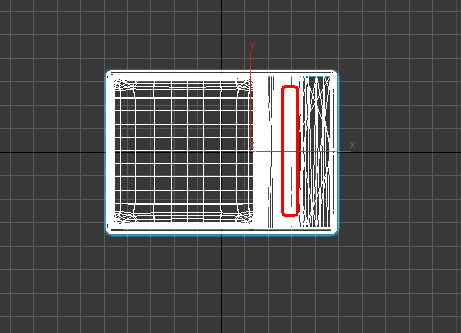
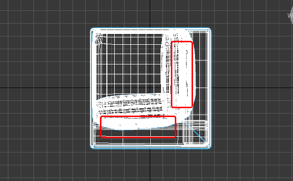
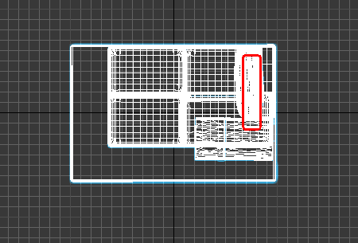
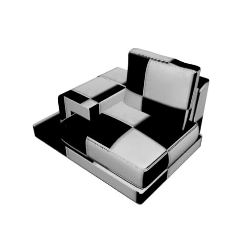
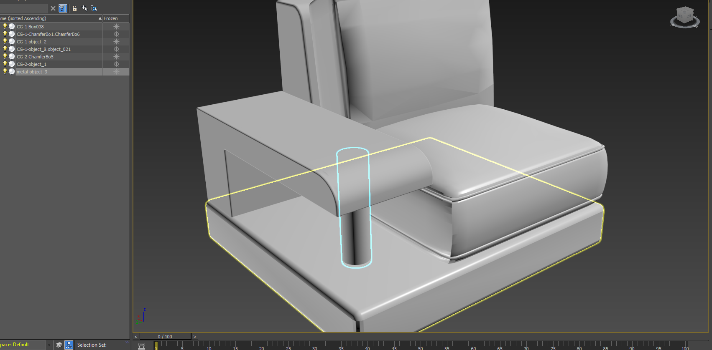
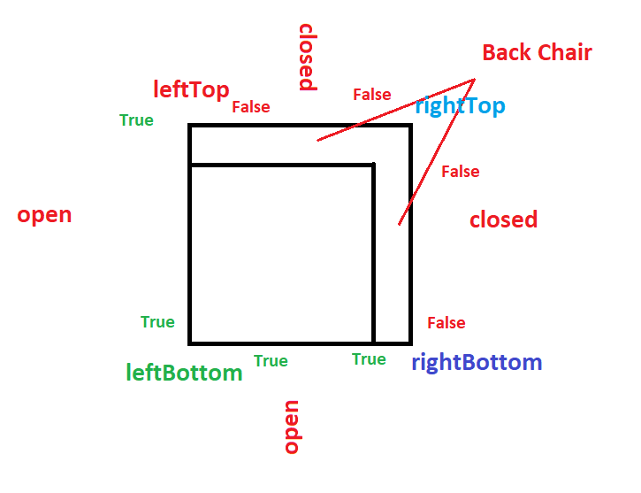

# 3D Sofa Price Calculator
 
  
## Project Folder Structure

### models 
Contains all sofa elements
### textures
Contains all texture data(leathers, sprites)
## Model preparation
All models are 3DS format.
### Positioning
All models should be located in x : 0 and y : 0

 

### Rotation

The backchair should be located from right

 

 

 

### UV Info

 

All UV information should be prepared like above image

## Dividing material groups

Before export to 3DS file, all objects should be named with special prefixes

For example,

The objects which should be colored with primary color, will be named with prefix : **"CG-1".**

Otherwise the objects which should be colored with secondary color, will be named with prefix : **"CG-2"**.

The object which should have glass or metal materials, will be named with prefixes : **"glass"** and **"metal"**

 

As you can see from above box, the cylinder is pillar and should have metal material.

So that it has **"metal-"** as a prefix in it's name.

## Representation of expanding information

All sofa element may have expanding availabilities to every direction.

So that availabilities should be represented in javascript

That info are below

	combineInfo : {
        backChair   : ['top'], //back chair position
        leftTop     : [false,false],
        rightTop    : [false,true],
        rightBottom : [true,false],
        leftBottom  : [false,false]
   	}

The explanations of this structure are below.

 

And these information will be used to create add ( + ) sprites for every sofa elements

## Code Analysis

### The representation of sofa information

	{

        name 			: "LV8005",        //category
        thumbImage 			: 'images/jori-glove-pure-2018.jpg', //thumb image url for this category
        description			: "Cuno Frommherz",  //description
        components 			: [
            //real sofa element
	    {
                name 		: "LV8005 1",
                thumbImage 		: "LV8005-1.jpg", //thumb image url for this item
                data 		: "LV8005-1.3DS", //indicate model file url
             	//expanding information
                combineInfo : {
                    backChair   	: ['top'],
                    leftTop     	: [false,false],
                    rightTop    	: [false,true],
                    rightBottom 	: [true,false],
                    leftBottom  	: [false,false]
                }
            },
            {
                name 		: "LV8005 3",
                thumbImage 		: "LV8005-3.jpg",
                data 		: "LV8005-3.3DS",
                combineInfo : {
                    backChair   	: ['top'],
                    leftTop     	: [true,false],
                    rightTop    	: [false,true],
                    rightBottom 	: [true,false],
                    leftBottom  	: [false,true]
                }
            },
            ................................................................
            {
                name : "LV8005 B6",
                thumbImage : "LV8005-B6.jpg",
                data : "LV8005-B6.3DS"
            },
        ]
    },

### The Representation of color information.

	lstColor = [
	    {
	        category : "bonded", //leather type
	        list : [
	            "9d4f0d", //color value(rgb hex)
	            "706166",
	            "3c1a1b",
	            "5d270b"
	        ]
	    },
	    {
	        category : "genuine",
	        list : [
	            "414352",
	            "6b7380"
	        ]
	    },
	    {
	        category : "italian",
	        list : [
	            "5e602e",
	             "412d24",
	        ]	    
	    }
	]

## The variable which contains all sofa information

SofaConfigurator -> lstElement;

**Structure**

	{
        name : object.name, //unique name for this object
        model : object //3ds models with sprites etc.
  	}
